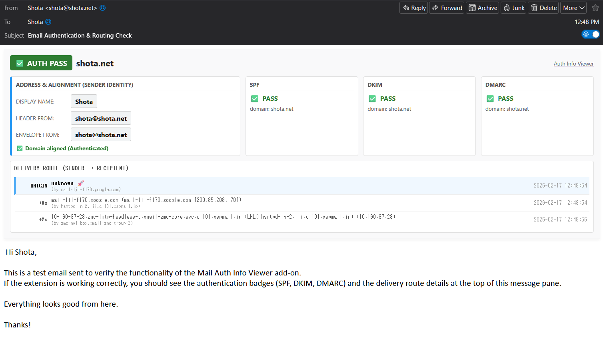
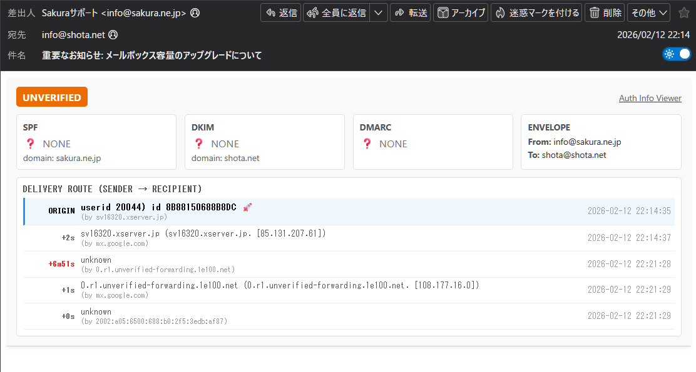

# Mail Auth Info Viewer

**A Thunderbird add-on to visualize email authentication and delivery routes.**
**メールの認証情報と送達経路を可視化するThunderbirdアドオンです。**

Mail Auth Info Viewer is a simple yet powerful tool for Thunderbird that helps you verify the authenticity of emails and troubleshoot delivery issues. It displays a clear summary of authentication results (SPF, DKIM, DMARC) and visualizes the email's journey with time delays directly on the message view.

Mail Auth Info Viewer は、Thunderbird用のシンプルかつ強力なツールです。メールの真正性を検証し、配送トラブルを解決するのに役立ちます。認証結果（SPF, DKIM, DMARC）の明確な概要を表示し、メールの送達経路と遅延時間をメッセージ表示画面に直接可視化します。

---

## 📸 Screenshots / スクリーンショット

### Authenticated & Fast Delivery (認証成功・正常な経路)

### Unverified & Delayed Routing (未認証・遅延発生の警告)

---

## 🌟 Key Features / 主な機能

* **Authentication Status:** Quickly check the pass/fail status of SPF, DKIM, and DMARC authentication.
    * **認証ステータス:** SPF、DKIM、DMARC認証の成功/失敗ステータスを素早く確認できます。
* **Delivery Route Visualization:** View the email's path from the sender (ORIGIN) to your inbox, including calculated time delays between each hop. Long delays are highlighted in red/orange.
    * **送達経路の可視化:** 送信元（ORIGIN）から受信ボックスまでのメールの経路を、各ホップ間の遅延時間とともに表示します。大きな遅延は赤やオレンジで強調されます。
* **Envelope Information:** Displays the actual "From" and "To" addresses from the email envelope.
    * **エンベロープ情報:** メールのエンベロープ（封筒）に記載された実際の送信元と宛先アドレスを表示します。
* **Clear Dashboard:** Presents all information in an easy-to-read dashboard with clear color-coded badges.
    * **明確なダッシュボード:** すべての情報を、色分けされた明確なバッジ付きの読みやすいダッシュボードで提示します。

## 🚀 How to Use / 使い方

After installing the add-on, simply open any email in Thunderbird. A new information panel will appear at the top of the message view.

アドオンをインストールした後、Thunderbirdでメールを開くだけです。メッセージ表示画面の上部に新しい情報パネルが表示されます。

* **Overall Status:** A large badge indicates the overall authentication status (e.g., `AUTHENTICATED`, `AUTH FAILED`, `UNVERIFIED`).
    * **総合ステータス:** 大きなバッジが総合的な認証ステータス（例: `AUTHENTICATED`, `AUTH FAILED`, `UNVERIFIED`）を示します。
* **Auth Cards:** Check the individual status of SPF, DKIM, and DMARC (✅ PASS, ❌ FAIL, ⚠️ SOFTFAIL/NONE).
    * **認証カード:** SPF、DKIM、DMARCの個別のステータス（✅ PASS, ❌ FAIL, ⚠️ SOFTFAIL/NONE）を確認します。
* **Delivery Route:** The table at the bottom shows the path. The first row ("ORIGIN 🚀") is the sender. The time difference between each hop is shown on the left.
    * **送達経路:** 下部のテーブルが経路を示します。最初の行（"ORIGIN 🚀"）が送信元です。各ホップ間の時間差が左側に表示されます。

## 📥 Installation / インストール

[**Download from ATN (Thunderbird Add-ons)**](https://addons.thunderbird.net/ja/thunderbird/addon/YOUR-ADDON-SLUG-HERE/)

You can also download the latest release directly from GitHub:  
GitHubのReleasesからも最新版をダウンロードできます:  
[**GitHub Releases**](https://github.com/shotacure/MailAuthInfoViewer/releases)

---

## 📝 License / ライセンス

This project is licensed under the GNU General Public License v3.0 (GPLv3).
このプロジェクトは、GNU General Public License v3.0 (GPLv3) の下でライセンスされています。

See the [LICENSE](LICENSE) file for details.  
詳細は [LICENSE](LICENSE) ファイルをご覧ください。