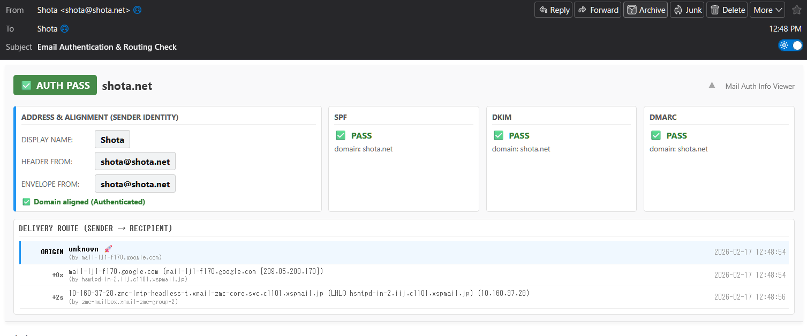

# Mail Auth Info Viewer

**A Thunderbird add-on to visualize email authentication, sender identity, and delivery routes.**
**メールの認証情報、送信者の身元、および送達経路を可視化するThunderbirdアドオンです。**

Mail Auth Info Viewer is a powerful Thunderbird add-on designed to combat sophisticated phishing and "display name" spoofing. It analyzes message headers locally and presents a clear, color-coded dashboard showing sender alignment, authentication results (SPF, DKIM, DMARC), and delivery routes with time delays directly on the message view.

Mail Auth Info Viewer は、巧妙なフィッシング詐欺や「表示名（名乗り）」の偽装に対抗するために設計された強力なThunderbirdアドオンです。ローカルでメールヘッダを解析し、送信者のアライメント、認証結果（SPF, DKIM, DMARC）、および遅延時間を含む送達経路を、色分けされた分かりやすいダッシュボードでメッセージ画面上に直接表示します。

---

## 📸 Screenshots / スクリーンショット

### Fully Authenticated & Aligned (認証成功・ドメイン一致)
For fully authenticated and safe emails, the dashboard automatically collapses to save screen space while keeping the top status badge visible.
安全な認証済みメールの場合、画面スペースを節約するためにダッシュボードは自動的に折りたたまれます（上部のステータスバッジのみ表示）。



### Unverified & Delayed Routing (未認証・遅延発生の警告)


---

## 🌟 Key Features / 主な機能

* **Smart Auto-Collapse:** The dashboard stays neatly collapsed for safe, authenticated emails to maximize your reading space. It automatically expands with a smooth animation only when an unverified sender or a domain mismatch is detected.
    * **スマート自動折りたたみ:** 安全な認証済みメールではダッシュボードが自動で折りたたまれ、メール本文の閲覧スペースを広く保ちます。未認証やドメイン不一致を検知した「要確認」のメールの場合のみ、自動的にスライド展開して警告します。
* **Sender Identity & Alignment:** Instantly spot discrepancies between the Display Name, Header From, and Envelope From addresses side-by-side.
    * **送信者の身元とアライメント検証:** 「表示名」「ヘッダFrom」「エンベロープFrom」を並べて表示し、アドレスの不自然な乖離や偽装を瞬時に見抜きます。
* **Domain Verification Badge:** Prominently displays the actual authenticated domain (e.g., `✅ AUTH PASS example.com`) to prevent false trust in fake display names.
    * **ドメイン認証バッジ:** 単なる「認証済」ではなく、実際に認証されたドメイン名を明記し、誤った安心感を与えません。
* **Authentication Status:** Quickly check the pass/fail status of SPF, DKIM, and DMARC authentication with DMARC policy display.
    * **認証ステータス:** SPF、DKIM、DMARCの成否ステータスをDMARCポリシー表示と共に素早く確認できます。
* **Delivery Route Visualization:** View the email's path from the sender (ORIGIN) to your inbox, including calculated time delays between each hop.
    * **送達経路の可視化:** 送信元（ORIGIN）から受信ボックスまでのメールの経路を、各ホップ間の遅延時間とともに表示します。
* **Dark Mode:** Full dark mode support that follows your system preference.
    * **ダークモード:** システムの設定に連動した完全なダークモード対応。
* **12-Language Support (i18n):** Available in English, Japanese, French, German, Spanish, Arabic, Korean, Traditional Chinese, Simplified Chinese, Portuguese (Brazil), Russian, and Italian.
    * **12言語対応 (i18n):** 英語、日本語、フランス語、ドイツ語、スペイン語、アラビア語、韓国語、繁体字中国語、簡体字中国語、ポルトガル語（ブラジル）、ロシア語、イタリア語に対応。
* **Organizational Domain Comparison (RFC 7489):** Uses a curated Public Suffix List to accurately compare domains. For example, `aaa.bbb.google.com` and `ccc.google.com` are correctly recognized as aligned.
    * **組織ドメイン比較 (RFC 7489):** Public Suffix Listを使用してドメインを正確に比較。例えば `aaa.bbb.google.com` と `ccc.google.com` は共に `google.com` として正しく一致判定されます。
* **Mailing List Detection:** When `List-Id` or `List-Unsubscribe` headers are present, the dashboard clearly indicates "via Mailing List" to explain domain mismatches caused by list forwarding.
    * **メーリングリスト検知:** `List-Id` や `List-Unsubscribe` ヘッダの存在時、「メーリングリスト経由」と明示し、転送によるドメイン不一致を説明します。
* **Trusted Authentication Filtering (authserv-id):** Filters `Authentication-Results` headers to only trust those from the receiving mail server, reducing the risk of spoofed authentication results.
    * **信頼できる認証結果のフィルタリング (authserv-id):** 受信メールサーバーの `Authentication-Results` ヘッダのみを信頼し、偽装された認証結果のリスクを低減します。
* **Privacy First:** All processing is performed strictly locally within Thunderbird. No external network requests are made.
    * **プライバシー重視:** すべての解析処理はThunderbird内でローカルに完結します。外部ネットワークへの通信は一切行いません。

---

## 🚀 How to Use / 使い方

After installing the add-on, simply open any email in Thunderbird. A new information panel will appear at the top of the message view.

アドオンをインストールした後、Thunderbirdでメールを開くだけです。メッセージ表示画面の上部に新しい情報パネルが表示されます。

* **Overall Status:** A large badge indicates the verified domain or issues (e.g., `✅ AUTH PASS`, `❌ AUTH FAILED`, `⚠️ AUTH PASS (DOMAIN MISMATCH)`, `UNVERIFIED`).
    * **総合ステータス:** 大きなバッジが認証されたドメインや問題を警告します。
* **Manual Toggle:** You can click the header bar at any time to expand or collapse the detailed view.
    * **手動開閉:** ヘッダーバーをクリックすることで、いつでも詳細ビューの展開・折りたたみを切り替えられます。
* **Address & Alignment:** Highlights the sender's addresses. If the domain doesn't match the authenticated envelope, it alerts you to potential spoofing or mailing list routing.
    * **アドレスとアライメント:** 送信者のアドレスを強調表示します。ドメインがエンベロープと一致しない場合、なりすましやメーリングリスト経由の可能性を警告します。
* **Delivery Route:** The table at the bottom shows the path. The first row ("ORIGIN 🚀") is the sender. The time difference between each hop is shown on the left.
    * **送達経路:** 下部のテーブルが経路を示します。最初の行（"ORIGIN 🚀"）が送信元です。各ホップ間の時間差が左側に表示されます。

---

## 📥 Installation / インストール

[**Download from ATN (Thunderbird Add-ons)**](https://addons.thunderbird.net/ja/thunderbird/addon/mail-auth-info-viewer/)

You can also download the latest release directly from GitHub:
GitHubのReleasesからも最新版をダウンロードできます:
[**GitHub Releases**](https://github.com/shotacure/MailAuthInfoViewer/releases)

---

## 🏗️ Building from Source / ソースからのビルド

### Windows (PowerShell)
```powershell
pwsh -NoProfile -ExecutionPolicy Bypass -File build.ps1
```

### Linux / macOS (Bash)
```bash
chmod +x build.sh
./build.sh
```

Both scripts read the version from `manifest.json`, stage the required files including `_locales/`, produce a `.xpi` package in `.release/`, and generate a SHA-256 checksum file.

---

## 🏛️ Architecture / アーキテクチャ

```
manifest.json           Extension manifest with i18n support
background.js           Registers content scripts, handles message API
psl_data.js             Public Suffix List data + getOrganizationalDomain()
messagedisplay.js       Main logic — 5 core functions:
│
├─ parseEnvelope()          Address extraction, PSL-based alignment, mailing list detection
├─ parseAuthResults()       Auth parsing with authserv-id filtering & multi-DKIM
├─ parseRoute()             Delivery route from Received headers
├─ determineSecurityStatus()  Aggregate security verdict
└─ buildUI()                i18n'd, dark-mode-aware rendering

_locales/
├─ en/messages.json     English (default)
├─ ja/messages.json     日本語
├─ fr/messages.json     Français
├─ de/messages.json     Deutsch
├─ es/messages.json     Español
├─ ar/messages.json     العربية
├─ ko/messages.json     한국어
├─ zh_TW/messages.json  繁體中文
├─ zh_CN/messages.json  简体中文
├─ pt_BR/messages.json  Português (Brasil)
├─ ru/messages.json     Русский
└─ it/messages.json     Italiano
```

### Domain Alignment: Organizational Domain (RFC 7489)

Previous versions used simple suffix matching (`endsWith`), which could produce false positives with multi-level TLDs (e.g., `evil.co.jp` matching `legit.co.jp`) and false negatives with deep subdomains (e.g., `a.b.google.com` not matching `c.google.com`).

v1.0.8 bundles a curated Public Suffix List (`psl_data.js`) covering 60+ countries to extract the **Organizational Domain** per RFC 7489. Both the Header-From domain and Envelope-From domain are reduced to their organizational domain before comparison.

### authserv-id Trust Filtering

`Authentication-Results` headers can be injected by any MTA in the delivery chain. To mitigate spoofed results, v1.0.8 compares each header's `authserv-id` (the hostname before the first semicolon) against the `by` hostname of the most recent `Received` header. Only matching headers are trusted. `ARC-Authentication-Results` are exempt from this filter as they have their own chain validation mechanism.

---

## ⚠️ Known Limitations / 既知の制限事項

* **Public Suffix List is curated, not exhaustive.** The bundled PSL covers the vast majority of email traffic (~60 countries + major hosted services), but exotic or newly created TLDs may fall back to the default single-level TLD assumption. Contributions to expand the list are welcome.
* **authserv-id filtering is best-effort.** If the receiving MTA's hostname doesn't match any `authserv-id`, the filter falls back to trusting all headers. This ensures compatibility but reduces protection in edge cases.
* **No BIMI or MTA-STS support.** These protocols require network lookups and are out of scope for a privacy-first local-only add-on.
* **i18n coverage.** Technical terms (SPF, DKIM, DMARC, PASS, FAIL) remain in English across all locales for consistency and recognition.

---

## 📝 License / ライセンス

This project is licensed under the GNU General Public License v3.0 (GPLv3).
このプロジェクトは、GNU General Public License v3.0 (GPLv3) の下でライセンスされています。

See the [LICENSE](LICENSE) file for details.
詳細は [LICENSE](LICENSE) ファイルをご覧ください。
