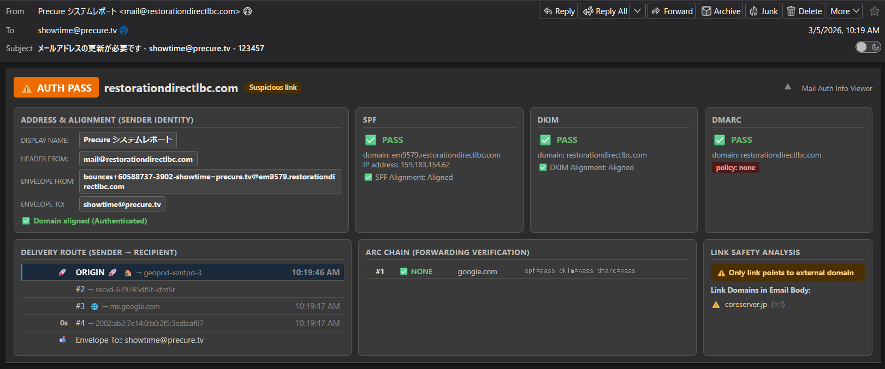
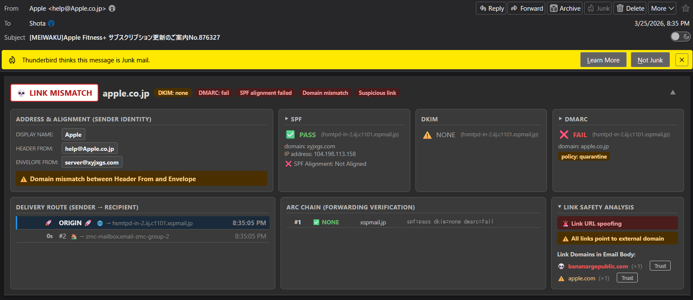

# Mail Auth Info Viewer

**A Thunderbird add-on to visualize email authentication, sender identity, and delivery routes.**
**メールの認証情報、送信者の身元、および送達経路を可視化するThunderbirdアドオンです。**

Mail Auth Info Viewer is a powerful Thunderbird add-on designed to combat sophisticated phishing and "display name" spoofing. It analyzes message headers and body content locally, presenting a clear, color-coded dashboard showing sender alignment, authentication results (SPF, DKIM, DMARC), phishing link detection, and delivery routes with time delays directly on the message view.

Mail Auth Info Viewer は、巧妙なフィッシング詐欺や「表示名（名乗り）」の偽装に対抗するために設計された強力なThunderbirdアドオンです。ローカルでメールヘッダと本文を解析し、送信者のアライメント、認証結果（SPF, DKIM, DMARC）、フィッシングリンク検知、および遅延時間を含む送達経路を、色分けされた分かりやすいダッシュボードでメッセージ画面上に直接表示します。

---

## 📸 Screenshots / スクリーンショット

### ✅ Fully Authenticated (認証成功)
The dashboard always starts collapsed to save screen space, showing only the status badge and verdict tags.
ダッシュボードは常に折りたたまれた状態で表示され、ステータスバッジと判定タグのみが見えます。


Click to expand the full dashboard with authentication details, delivery route, ARC chain, and link safety analysis.
クリックで認証詳細・送達経路・ARCチェーン・リンク安全性分析の完全なダッシュボードを展開します。


### ⚠️ Suspicious Link Detected (不審なリンク検出)
Authentication passes, but the email body contains a link indicator — either a genuinely suspicious pattern (IP-address link, IDN homograph, URL shortener) or simply an untrusted external domain. The badge shows AUTH PASS in orange with either a "Suspicious link" or "Untrusted link domain" verdict tag, depending on the nature of the finding.
認証は成功していますが、メール本文にリンク指標が含まれています — 本質的に怪しいパターン（IPアドレスリンク、IDNホモグラフ、短縮URL）か、単に未信頼の外部ドメインかのいずれかです。バッジはオレンジの認証成功に、指標の性質に応じて「不審なリンク」または「未信頼のリンクドメイン」の判定理由タグが付きます。


### ❌ Authentication Failed (認証失敗)
SPF, DKIM, or DMARC has explicitly failed. The red badge with individual verdict reason tags shows exactly what went wrong.
SPF・DKIM・DMARCのいずれかが明確に失敗しています。赤いバッジに個別の判定理由タグが表示され、何が問題かが一目瞭然です。


### 💀 Link Mismatch Detected (リンク偽装検出)
Deceptive link text detected — the displayed URL differs from the actual destination. The flashing LINK MISMATCH badge is the highest severity level, overriding all other verdicts.
リンクテキスト偽装を検出 — 表示URLと実際のリンク先が異なります。点滅するLINK MISMATCHバッジは最高レベルの深刻度で、他のすべての判定を上書きします。


---

## 🌟 Key Features / 主な機能

* **Shadow DOM CSS Isolation:** The dashboard is encapsulated in a closed Shadow DOM, completely preventing HTML email CSS (e.g., `* { font-size: 20px !important; }`) from contaminating the add-on display.
    * **Shadow DOM CSS隔離:** ダッシュボードをclosed Shadow DOMでカプセル化し、HTMLメールのCSSがアドオン表示に影響することを完全に防止します。
* **Always-Collapsed Panel:** The dashboard always starts collapsed for every email, keeping the status badge and verdict reason tags visible at a glance without consuming screen space. Click to expand for full details.
    * **常時折りたたみパネル:** ダッシュボードは全メールで折りたたまれた状態で表示され、ステータスバッジと判定理由タグのみが見える省スペース設計です。クリックで詳細を展開できます。
* **Manual Toggle:** You can expand or collapse the detail view at any time by clicking the header bar.
    * **手動開閉:** ヘッダーバーをクリックすることで、いつでも詳細ビューの展開・折りたたみを切り替えられます。
* **Collapsible Detail Cards:** SPF, DKIM, and DMARC cards show status at a glance with expandable details on click. Link Safety Analysis shows warnings upfront with collapsible domain/resource lists (auto-expanded when any finding is detected).
    * **折りたたみ式詳細カード:** SPF・DKIM・DMARCカードはクリックで詳細を展開。リンク安全性分析は警告を常時表示し、ドメイン/リソース一覧は折りたたみ（指標検出時は自動展開）。
* **Sender Identity & Alignment:** Instantly spot discrepancies between the Display Name, Header From, and Envelope From addresses side-by-side.
    * **送信者の身元とアライメント検証:** 「表示名」「ヘッダFrom」「エンベロープFrom」を並べて表示し、アドレスの不自然な乖離や偽装を瞬時に見抜きます。
* **Display Name Spoofing Detection:** Detects when the display name contains an email address from a different domain than the actual sender — a common phishing trick to mislead recipients.
    * **表示名なりすまし検知:** 表示名に実際の送信元とは異なるドメインのメールアドレスが含まれている場合を検知します。受信者を欺くためのフィッシング手口です。
* **Domain Verification Badge:** Prominently displays the actual authenticated domain (e.g., `✅ AUTH PASS example.com`) to prevent false trust in fake display names.
    * **ドメイン認証バッジ:** 単なる「認証済」ではなく、実際に認証されたドメイン名を明記し、誤った安心感を与えません。
* **Verdict Reason Display:** Shows why the badge is not green — e.g., "DMARC policy is p=none", "Phishing indicator detected", "Untrusted link domain" — so administrators know exactly what to fix or trust.
    * **判定理由の表示:** バッジがグリーンでない理由（例：「DMARCポリシーがp=none」「フィッシング指標を検出」「未信頼のリンクドメイン」）を表示し、管理者が何を修正または信頼すべきか明確にします。
* **Four-Tier Link Safety Analysis:** Scans email body with severity-aware categorization:
    * **critical** — deceptive link text, dangerous URI schemes (`javascript:`, `data:`), embedded HTML forms (promoted to phishing badge)
    * **suspicious** — IP-address links, IDN homograph attacks, URL shorteners (patterns inherently risky regardless of trust)
    * **untrusted** — all links external, main CTA external (a single domain unknown to the extension, resolvable by trusting the domain)
    * **privacy** — tracking pixels (informational notice, does not affect verdict)
    * **4段階リンク安全性分析:** メール本文を深刻度別にスキャン:
    * **critical** — リンクテキスト偽装、危険なURIスキーム（`javascript:`、`data:`）、HTMLフォーム埋め込み（フィッシングバッジに昇格）
    * **suspicious** — IPアドレスリンク、IDNホモグラフ攻撃、短縮URL（信頼リストでは解消しない本質的に怪しいパターン）
    * **untrusted** — 全リンク外部、メインCTA外部（ドメインが未知なだけ。信頼リスト追加で解消）
    * **privacy** — トラッキングピクセル（プライバシー上の注意喚起。判定には影響しない）
* **Link Domain Overview:** Lists all unique link domains found in the email body, color-coded by whether they match the sender's organizational domain, with inline tracker markers for tracking pixel sources.
    * **リンクドメイン一覧:** メール本文に含まれるすべてのリンクドメインを一覧表示し、送信者の組織ドメインとの一致/不一致を色分けします。トラッキングピクセル配信元はインラインマーカーで示します。
* **Reply-To Mismatch Detection:** Warns when the Reply-To address belongs to a different domain than the sender, a technique used to redirect replies to attackers.
    * **Reply-To不一致検知:** Reply-Toアドレスが送信者と異なるドメインの場合に警告します。返信を攻撃者に誘導するフィッシング手口です。
* **Trusted Link Domains with Inline Shortcut:** When an untrusted link indicator involves a single external domain, a Trust button appears directly on the finding row for one-click whitelisting. Otherwise, individual Trust buttons appear next to each external domain in the domain list. Whitelisted domains suppress untrusted-link warnings; deceptive link text (displayed URL differing from the actual destination) is always flagged regardless of the trust list, because a mismatch between what is shown and where a link goes is deceptive no matter who owns the destination. Manage trusted domains from the add-on settings page with text-based import/export.
    * **信頼済みリンクドメインとインラインショートカット:** 未信頼のリンク指標が外部ドメイン1つに特定できる場合、findings行に直接Trustボタンが表示され、ワンクリックでホワイトリスト登録できます。それ以外の場合はドメイン一覧の各外部ドメイン横のTrustボタンを使用します。ホワイトリスト登録済みドメインは未信頼リンク警告を抑制します。一方、リンクテキスト偽装（表示URLと実際のリンク先の不一致）は、リンク先の所有者に関わらず「見せている先と飛ぶ先が違う」こと自体が欺瞞であるため、信頼リストに関係なく常に警告します。アドオン設定画面からテキスト形式のインポート/エクスポートで管理可能。
* **Authentication Status:** Quickly check the pass/fail status of SPF, DKIM, and DMARC authentication with DMARC policy display.
    * **認証ステータス:** SPF、DKIM、DMARCの成否ステータスをDMARCポリシー表示と共に素早く確認できます。
* **DMARC Alignment Indicators (RFC 7489):** SPF and DKIM alignment status shown within each authentication card. Alignment is evaluated only for signatures that passed authentication — failed signatures are excluded from alignment consideration. The security verdict requires DMARC pass and at least one alignment match for AUTH PASS.
    * **DMARCアライメント表示 (RFC 7489):** SPFとDKIMのアライメント状態を各認証カード内に表示。アライメント評価は認証に成功した署名のみが対象で、失敗した署名はアライメント判定から除外されます。セキュリティ判定にはDMARC passと少なくとも一方のアライメント一致が必要です。
* **Individual DKIM Signatures:** When multiple DKIM signatures exist, each is displayed individually with its pass/fail status, signing domain, and DKIM selector (`s=`), with deduplication across headers.
    * **個別DKIM署名表示:** 複数のDKIM署名がある場合、各署名のpass/fail状態・署名ドメイン・DKIMセレクター (`s=`) を個別に表示。ヘッダ間の重複は自動排除します。
* **ARC Chain Visualization (RFC 8617):** Displays the Authenticated Received Chain with verification status, signing domain, and authentication summary for each forwarding hop.
    * **ARCチェーン表示 (RFC 8617):** メール転送時のAuthenticated Received Chainを、検証状態・署名ドメイン・認証サマリーとともに表示します。
* **Delivery Route Visualization:** View the email's path from the sender (ORIGIN) to your inbox, including calculated time delays between each hop, Envelope-To recipient, and IP type indicators (🏠 internal / 🌐 external with IP address tooltips).
    * **送達経路の可視化:** 送信元（ORIGIN）から受信ボックスまでのメールの経路を、各ホップ間の遅延時間、受信先（Envelope-To）、IPタイプ表示（🏠内部/🌐外部、ツールチップにIPアドレス表示）とともに表示します。
* **Received-SPF Fallback:** When `Authentication-Results` headers lack SPF data, the add-on falls back to `Received-SPF` headers for compatibility with older mail servers.
    * **Received-SPFフォールバック:** Authentication-ResultsにSPF結果がない場合、Received-SPFヘッダから自動的に取得し、古いメールサーバーとの互換性を確保します。
* **Address & Alignment:** Highlights the sender's addresses. If the domain doesn't match the authenticated envelope, it alerts you to potential spoofing or mailing list routing.
    * **アドレスとアライメント:** 送信者のアドレスを強調表示します。ドメインがエンベロープと一致しない場合、なりすましやメーリングリスト経由の可能性を警告します。
* **Delivery Route:** The table at the bottom shows the path. The first row ("ORIGIN 🚀") is the sender. The time difference between each hop is shown on the left.
    * **送達経路:** 下部のテーブルが経路を示します。最初の行（"ORIGIN 🚀"）が送信元です。各ホップ間の時間差が左側に表示されます。
* **Organizational Domain Comparison (RFC 7489):** Uses a curated Public Suffix List covering 60+ countries for accurate domain alignment.
    * **組織ドメイン比較 (RFC 7489):** 60か国以上をカバーするPublic Suffix Listを使用してドメインを正確に比較します。
* **Mailing List Detection:** Indicates "via Mailing List" when `List-Id` or `List-Unsubscribe` headers are detected, explaining domain mismatches from list forwarding.
    * **メーリングリスト検知:** `List-Id` や `List-Unsubscribe` ヘッダの検出時に「メーリングリスト経由」と表示し、転送によるドメイン不一致を説明します。
* **Trusted Authentication Filtering (authserv-id):** Filters `Authentication-Results` headers to only trust those from the receiving mail server.
    * **信頼できる認証結果のフィルタリング (authserv-id):** 受信メールサーバーの `Authentication-Results` ヘッダのみを信頼します。
* **Dangerous Attachment Detection:** Scans attachment filenames in the MIME structure (no content download, fully local) and flags executables and scripts (exe, dll, msi, ps1, js, etc.), disguised double-extension files (e.g., invoice.pdf.exe, reported only when the final, actually-executable extension is dangerous — a legitimate jquery.js.zip is not flagged as critical), HTML attachments, and archive attachments whose contents cannot be inspected (zip, 7z, rar, tar, gz). Findings appear in a dedicated Attachments card; they are informational warnings and do not change the badge verdict.
    * **危険な添付ファイル検知:** MIME 構造の添付ファイル名を解析し（本文ダウンロードなし・完全ローカル）、実行形式・スクリプト（exe・dll・msi・ps1・js 等）、偽装二重拡張子（例：invoice.pdf.exe。実際に実行されうる最終拡張子が危険な場合のみ報告し、正当な jquery.js.zip のようなファイルは critical 判定しません）、HTML 添付、内容を検査できないアーカイブ添付（zip・7z・rar・tar・gz）を警告します。所見は専用の「添付ファイル」カードに表示され、バッジ判定には影響しません。
* **Authentication Strength Detection:** Flags weak authentication configurations that pass but leave fixable gaps: DKIM keys below 2048 bits (when the receiving server records the key length in Authentication-Results), deprecated rsa-sha1 signatures, partial body signing via the `l=` tag, weak DMARC subdomain policy (`sp=none` while the main policy is stronger), and partial DMARC enforcement (`pct` below 100, when recorded). Warnings appear inside the DKIM/DMARC cards as administrator guidance and do not affect the badge.
    * **認証強度検出:** 認証は pass していても改善可能な弱さが残る設定を警告します：2048ビット未満の DKIM 鍵（受信サーバーが Authentication-Results に鍵長を記録している場合）、非推奨の rsa-sha1 署名、`l=` タグによる本文の部分署名、メインポリシーより弱い DMARC サブドメインポリシー（`sp=none`）、部分施行（`pct` が 100 未満、記録がある場合）。警告は DKIM/DMARC カード内に管理者向け情報として表示され、バッジ判定には影響しません。
* **TLS Encryption Visualization in Delivery Route:** Each hop in the delivery route displays the TLS/encryption status recorded in its Received header: 🔒 with the version number for TLS-encrypted hops (⚠️ instead for legacy TLS 1.0/1.1), 🔓 when a plaintext protocol (SMTP/ESMTP without TLS details) was recorded, and a neutral dash when no information is available (e.g., internal delivery). Cipher suites are shown in tooltips.
    * **送達経路の TLS 可視化:** 各ホップの Received ヘッダに記録された TLS/暗号化状態を表示します：TLS 暗号化ホップは 🔒 とバージョン番号（旧版の TLS 1.0/1.1 は ⚠️）、平文プロトコル（TLS 情報のない SMTP/ESMTP）の記録は 🔓、判定材料がない場合（内部配送等）は中立のダッシュ表示。暗号スイートはツールチップで確認できます。
* **Report Copy to Clipboard:** A "Copy" button in the dashboard header copies a structured plain-text analysis report — verdict with reason tags, authentication results, alignment, strength warnings, sender identity, delivery route with TLS status, link safety findings, and attachment findings — ready to paste into team chats, tickets, or security incident reports.
    * **レポートのクリップボード機能:** ダッシュボードヘッダの「コピー」ボタンで、総合判定と判定理由・認証結果・アライメント・強度警告・送信者情報・TLS 状態付き送達経路・リンク安全性所見・添付ファイル所見を含む構造化プレーンテキストレポートをコピーできます。チームチャット・チケット・インシデント報告にそのまま貼り付けられます。
* **Dark Mode:** Full dark mode support that follows your system preference.
    * **ダークモード:** システムの設定に連動した完全なダークモード対応。
* **12-Language Support (i18n):** Available in English, Japanese, French, German, Spanish, Arabic, Korean, Traditional Chinese, Simplified Chinese, Portuguese (Brazil), Russian, and Italian.
    * **12言語対応:** 英語、日本語、フランス語、ドイツ語、スペイン語、アラビア語、韓国語、繁体字中国語、簡体字中国語、ポルトガル語（ブラジル）、ロシア語、イタリア語に対応。
* **Privacy First:** All processing is performed strictly locally within Thunderbird. No external network requests are made. No data is collected or transmitted.
    * **プライバシー重視:** すべての解析処理はThunderbird内でローカルに完結します。外部ネットワークへの通信は一切行いません。

---

## 🔒 Security Verdict Philosophy / セキュリティ判定の思想

This add-on is designed for mail administrators and security-conscious users who want to verify that email authentication is properly configured. The verdict logic is intentionally strict:

このアドオンは、メール認証が正しく設定されているかを確認したいメール管理者やセキュリティ意識の高いユーザー向けに設計されています。判定ロジックは意図的に厳格です:

### Badge Hierarchy / バッジ階層

| Badge | Condition | 条件 |
|-------|-----------|------|
| 💀 **LINK MISMATCH** | Deceptive link text (displayed URL differs from actual destination), dangerous URI schemes, or embedded HTML forms detected. Not suppressible by the trust list. | リンク先相違（表示URLと実際のリンク先が不一致）・危険なURIスキーム・HTMLフォーム埋め込みを検出。信頼リストでは抑制されない。 |
| ❌ **AUTH FAILED** | SPF, DKIM, or DMARC explicitly failed | SPF・DKIM・DMARCのいずれかが明示的にfail |
| ⚠️ **AUTH PASS** | DMARC passed but other issues (alignment, spoofing, suspicious links, untrusted link domains) | DMARC passだがアライメント・なりすまし・不審リンク・未信頼リンクドメイン等の問題あり |
| ⚠️ **PARTIAL** | Some auth passed but DMARC not passed | 一部認証passだがDMARC未通過 |
| ✅ **AUTH PASS** | All checks passed — safe | すべてのチェックに合格 — 安全 |

### Link Safety Severity Levels / リンク安全性の深刻度レベル

v1.1.6 introduces a four-tier categorization of link indicators. Each tier has a distinct severity and user action path:

v1.1.6 ではリンク指標を4段階に分類しています。それぞれ深刻度とユーザーが取るべきアクションが異なります:

| Level | Examples | Meaning | Resolvable by whitelisting? |
|-------|----------|---------|-----------------------------|
| **critical** | Deceptive link text, `javascript:`/`data:` URIs, embedded forms | Confirmed phishing indicators (promotes to LINK MISMATCH badge) | No |
| **suspicious** | IP-address links, IDN homographs, URL shorteners | Patterns inherently risky regardless of who sent them | No |
| **untrusted** | All links external, main CTA external | Simply unknown to the extension — recipient hasn't trusted the domain yet | **Yes** (add to trusted domains) |
| **privacy** | Tracking pixels | Privacy notice only, not a phishing indicator | N/A (informational) |

| レベル | 例 | 意味 | ホワイトリストで解消可能か |
|--------|----|-------|---------------------------|
| **critical** | リンクテキスト偽装、`javascript:`/`data:` URI、フォーム埋め込み | 確度の高いフィッシング指標（LINK MISMATCHバッジに昇格） | 不可 |
| **suspicious** | IPアドレスリンク、IDNホモグラフ、短縮URL | 送信者に関係なく本質的に怪しい書式 | 不可 |
| **untrusted** | 全リンク外部、メインCTA外部 | 単にアドオンにとって未知なだけ — ユーザーがまだ信頼表明していない | **可**（信頼済みドメインに追加） |
| **privacy** | トラッキングピクセル | プライバシー上の注意喚起。フィッシング指標ではない | 該当なし（情報提供） |

### Green (✅ AUTH PASS) Requirements / グリーン条件

* SPF pass, DKIM pass, **and** DMARC pass
* At least one DMARC alignment (SPF or DKIM) with Header From — alignment only counts when the underlying auth method passed
* No display name spoofing detected
* No critical, suspicious, or untrusted link indicators detected in email body
* Note: Envelope domain mismatch alone does NOT block green when DMARC pass with alignment is satisfied (supports legitimate third-party sending services like SendGrid)
* Note: DMARC `p=none` does NOT block green (authentication itself succeeded), but the DMARC card highlights the weak policy in red for administrators
* Note: Authentication strength findings (sub-2048-bit DKIM keys, rsa-sha1, `l=` partial body signing, `sp=none`, `pct<100`) likewise do NOT affect the badge — they appear inside the DKIM/DMARC cards as administrator guidance, following the same treatment as `p=none`
* Note: Tracking pixels (privacy level) do NOT block green (ubiquitous in legitimate marketing emails), but are reported in the Link Safety Analysis card with 🕵️ markers
* Note: Untrusted link indicators remain orange (not green) until the user explicitly trusts the domain — the extension does not assume legitimacy for any unknown external domain

---

* SPF pass、DKIM pass、**かつ** DMARC pass
* SPFまたはDKIMの少なくとも一方がHeader Fromとアライメント（アライメントは対応する認証がpassの場合のみ成立）
* 表示名なりすましが検知されていないこと
* メール本文に critical・suspicious・untrusted のいずれのリンク指標も検知されていないこと
* 注: DMARCがpassかつアライメント成立時は、エンベロープドメイン不一致のみではグリーンを阻害しない（SendGrid等の正当な外部配信サービスに対応）
* 注: DMARC `p=none` はグリーンを阻害しない（認証自体は成功）が、DMARCカード内でポリシーを赤色表示して管理者に改善を促す
* 注: 認証強度の所見（2048ビット未満のDKIM鍵・rsa-sha1・`l=`部分署名・`sp=none`・`pct<100`）も同様にバッジ判定には影響しない — `p=none` と同じ扱いで、DKIM/DMARCカード内に管理者向け警告として表示する
* 注: トラッキングピクセル（privacyレベル）はグリーンを阻害しない（正規のマーケティングメールにほぼ必ず含まれるため）が、リンク安全性分析カード内で🕵️マーカー付きで報告する
* 注: 未信頼リンク指標はユーザーが明示的にドメインを信頼するまでオレンジのまま（グリーンにはならない） — アドオンは未知の外部ドメインに対し正当性を仮定しない

The principle is: **only unavoidable situations (e.g., third-party infrastructure) get a green badge; anything fixable by the domain administrator or resolvable by the recipient (via trust whitelisting) should be flagged.**

原則: **業者や設定を変えてもどうしようもない不可抗力だけをグリーンに。管理者の努力で解決できる不備、または受信者の信頼表明で解消できる未知ドメインは警告対象にする。**

### DMARC Policy Color Coding / DMARCポリシーの色分け

| Policy | Color | Meaning |
|--------|-------|---------|
| `reject` | 🔵 Blue | Strong protection — rejects unauthenticated mail |
| `quarantine` | 🟠 Orange | Partial protection — quarantines suspicious mail |
| `none` | 🔴 Red | No protection — a fixable configuration weakness |

| ポリシー | 色 | 意味 |
|--------|-----|------|
| `reject` | 🔵 ブルー | 強い保護 — 未認証メールを拒否 |
| `quarantine` | 🟠 オレンジ | 部分的保護 — 不審なメールを隔離 |
| `none` | 🔴 レッド | 保護なし — 設定変更で解決できる不備 |

---

## 📥 Installation / インストール

[**Download from ATN (Thunderbird Add-ons)**](https://addons.thunderbird.net/ja/thunderbird/addon/mail-auth-info-viewer/)

You can also download the latest release directly from GitHub:
GitHubのReleasesからも最新版をダウンロードできます:
[**GitHub Releases**](https://github.com/shotacure/MailAuthInfoViewer/releases)

---

## 🏗️ Building from Source / ソースからのビルド

### Windows (PowerShell)
```powershell
pwsh -NoProfile -ExecutionPolicy Bypass -File build.ps1
```

### Linux / macOS (Bash)
```bash
chmod +x build.sh
./build.sh
```

Both scripts read the version from `manifest.json`, stage the required files including `_locales/`, produce a `.xpi` package in `.release/`, and generate a SHA-256 checksum file.

---

## 🏛️ Architecture / アーキテクチャ

```
manifest.json           Extension manifest with i18n support
background.js           Registers content scripts, handles message API
psl_data.js             Public Suffix List data + getOrganizationalDomain()
options.html + options.js  Trusted link domains management (add/remove/import/export)
messagedisplay.js       Main logic — 10 core functions:
│
├─ parseEnvelope()          Address extraction, PSL-based alignment, mailing list, display name spoof & Reply-To mismatch detection
├─ parseAuthResults()       Auth parsing with authserv-id filtering & display, multi-DKIM with header.d/header.i fallback, per-signature alignment, Received-SPF fallback, RFC 8601 comment-aware semicolon splitting (preserves `header.d=` etc. when key-info such as `(2048-bit key; unprotected)` appears in DKIM results), authentication strength detection (sub-2048-bit DKIM keys from A-R comments, rsa-sha1, `l=` partial body signing, DMARC `sp=none` / `pct<100` from A-R comments)
├─ parseRoute()             Delivery route from Received headers with IP classification and per-hop TLS/encryption status extraction (TLS version, cipher suite, plaintext-protocol detection)
├─ parseArcChain()          ARC chain parsing (RFC 8617)
├─ parseMessageBody()       MIME tree traversal to extract HTML/text body content
├─ parseAttachments()       Attachment analysis with detection of dangerous file types (executables, scripts, double-extensions, HTML, encrypted archives)
├─ analyzeLinkSafety()      Four-tier phishing detection (critical/suspicious/untrusted/privacy): deceptive text, dangerous schemes, forms, IP/IDN/shortener links (aggregated per type), all-external & CTA analysis, tracking pixels, resource domains, trusted domain whitelist, external link domain collection for one-click trust
├─ determineSecurityStatus()  5-tier verdict (phishing > auth failed > auth pass warning > partial > auth pass) with auth-gated alignment, per-reason tags including "link_untrusted", and privacy-level findings excluded from verdict
├─ generateReportText()     Generates structured plain-text analysis report with all findings for clipboard export
└─ buildUI()                Shadow DOM isolated, i18n'd, dark-mode-aware rendering with always-collapsed panel, collapsible auth cards (full RFC 8601 properties), per-signature DKIM display, authentication strength warnings inside DKIM/DMARC cards, attachment warnings card with dangerous file type indicators, TLS status column in delivery route table with visual indicators (🔒⚠️🔓), full-width collapsible link safety with severity-aware styling (critical/suspicious/untrusted/privacy), inline Trust shortcut on untrusted findings when a single external domain is identified, copy-to-clipboard button in header, verdict reason tags

_locales/
├─ en/messages.json     English (default)
├─ ja/messages.json     日本語
├─ fr/messages.json     Français
├─ de/messages.json     Deutsch
├─ es/messages.json     Español
├─ ar/messages.json     العربية
├─ ko/messages.json     한국어
├─ zh_TW/messages.json  繁體中文
├─ zh_CN/messages.json  简体中文
├─ pt_BR/messages.json  Português (Brasil)
├─ ru/messages.json     Русский
└─ it/messages.json     Italiano
```

### Domain Alignment: Organizational Domain (RFC 7489)

Previous versions used simple suffix matching (`endsWith`), which could produce false positives with multi-level TLDs (e.g., `evil.co.jp` matching `legit.co.jp`) and false negatives with deep subdomains (e.g., `a.b.google.com` not matching `c.google.com`).

v1.0.8+ bundles a curated Public Suffix List (`psl_data.js`) covering 60+ countries to extract the **Organizational Domain** per RFC 7489. Both the Header-From domain and Envelope-From domain are reduced to their organizational domain before comparison.

---

## 📄 License / ライセンス

This project is licensed under the [GNU General Public License v3.0](LICENSE).

Copyright (C) 2025 Shota (SHOWTIME)