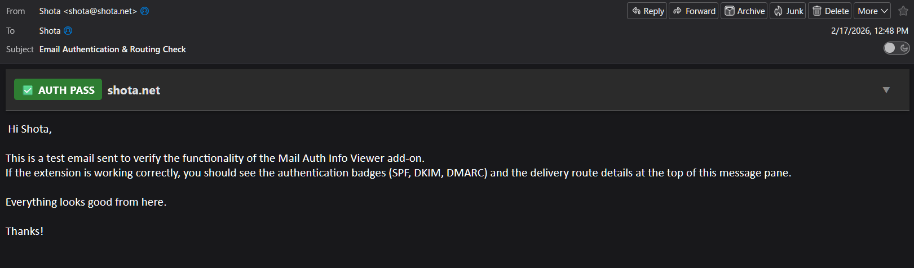
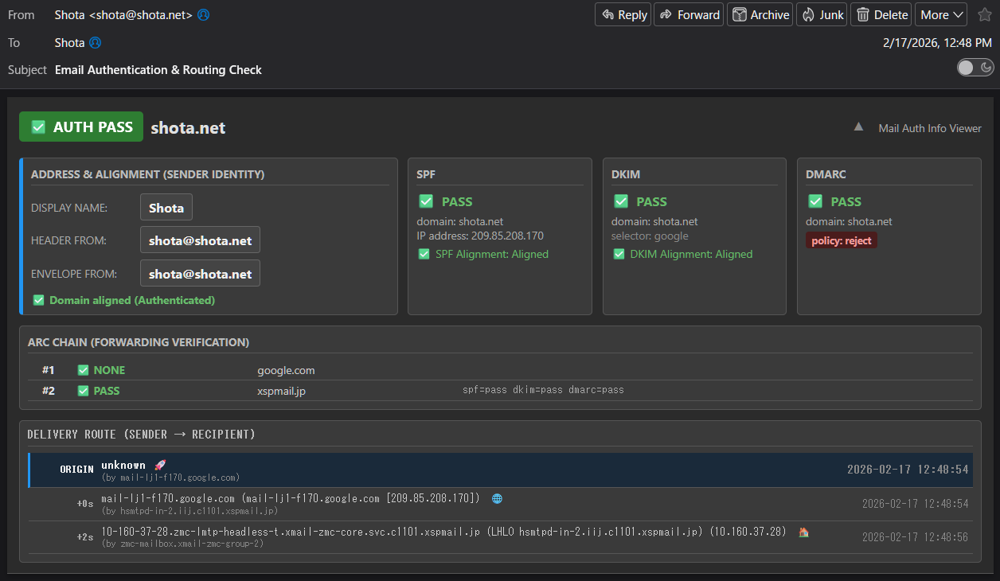
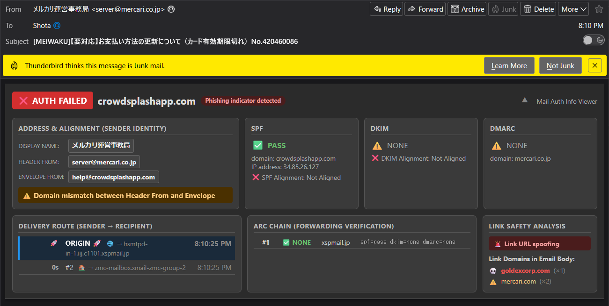

# Mail Auth Info Viewer

**A Thunderbird add-on to visualize email authentication, sender identity, and delivery routes.**
**メールの認証情報、送信者の身元、および送達経路を可視化するThunderbirdアドオンです。**

Mail Auth Info Viewer is a powerful Thunderbird add-on designed to combat sophisticated phishing and "display name" spoofing. It analyzes message headers and body content locally, presenting a clear, color-coded dashboard showing sender alignment, authentication results (SPF, DKIM, DMARC), phishing link detection, and delivery routes with time delays directly on the message view.

Mail Auth Info Viewer は、巧妙なフィッシング詐欺や「表示名（名乗り）」の偽装に対抗するために設計された強力なThunderbirdアドオンです。ローカルでメールヘッダと本文を解析し、送信者のアライメント、認証結果（SPF, DKIM, DMARC）、フィッシングリンク検知、および遅延時間を含む送達経路を、色分けされた分かりやすいダッシュボードでメッセージ画面上に直接表示します。

---

## 📸 Screenshots / スクリーンショット

### Fully Authenticated & Aligned (認証成功・ドメイン一致)
For fully authenticated and safe emails, the dashboard automatically collapses to save screen space while keeping the top status badge visible.
安全な認証済みメールの場合、画面スペースを節約するためにダッシュボードは自動的に折りたたまれます（上部のステータスバッジのみ表示）。



### Unverified & Delayed Routing (未認証・遅延発生の警告)


---

## 🌟 Key Features / 主な機能

* **Shadow DOM CSS Isolation:** The dashboard is encapsulated in a closed Shadow DOM, completely preventing HTML email CSS (e.g., `* { font-size: 20px !important; }`) from contaminating the add-on display.
    * **Shadow DOM CSS隔離:** ダッシュボードをclosed Shadow DOMでカプセル化し、HTMLメールのCSSがアドオン表示に影響することを完全に防止します。
* **Smart Auto-Collapse:** The dashboard stays neatly collapsed for safe, authenticated emails to maximize your reading space. It automatically expands with a smooth animation only when an unverified sender or a domain mismatch is detected.
    * **スマート自動折りたたみ:** 安全な認証済みメールではダッシュボードが自動で折りたたまれ、メール本文の閲覧スペースを広く保ちます。未認証やドメイン不一致を検知した「要確認」のメールの場合のみ、自動的にスライド展開して警告します。
* **Manual Toggle:** You can expand or collapse the detail view at any time by clicking the header bar.
    * **手動開閉:** ヘッダーバーをクリックすることで、いつでも詳細ビューの展開・折りたたみを切り替えられます。
* **Sender Identity & Alignment:** Instantly spot discrepancies between the Display Name, Header From, and Envelope From addresses side-by-side.
    * **送信者の身元とアライメント検証:** 「表示名」「ヘッダFrom」「エンベロープFrom」を並べて表示し、アドレスの不自然な乖離や偽装を瞬時に見抜きます。
* **Display Name Spoofing Detection:** Detects when the display name contains an email address from a different domain than the actual sender — a common phishing trick to mislead recipients.
    * **表示名なりすまし検知:** 表示名に実際の送信元とは異なるドメインのメールアドレスが含まれている場合を検知します。受信者を欺くためのフィッシング手口です。
* **Domain Verification Badge:** Prominently displays the actual authenticated domain (e.g., `✅ AUTH PASS example.com`) to prevent false trust in fake display names.
    * **ドメイン認証バッジ:** 単なる「認証済」ではなく、実際に認証されたドメイン名を明記し、誤った安心感を与えません。
* **Verdict Reason Display:** Shows why the badge is not green — e.g., "DMARC policy is p=none", "Phishing indicator detected" — so administrators know exactly what to fix.
    * **判定理由の表示:** バッジがグリーンでない理由（例：「DMARCポリシーがp=none」「フィッシング指標を検出」）を表示し、管理者が何を修正すべきか明確にします。
* **Link Safety Analysis:** Scans email body for phishing indicators including deceptive link text, dangerous URI schemes (`javascript:`, `data:`), embedded HTML forms, IP address links, IDN homograph attacks, and URL shorteners.
    * **リンク安全性分析:** メール本文をスキャンし、リンクテキスト偽装、危険なURIスキーム（`javascript:`、`data:`）、HTMLフォーム埋め込み、IPアドレスリンク、IDNホモグラフ攻撃、短縮URLなどのフィッシング指標を検出します。
* **Link Domain Overview:** Lists all unique link domains found in the email body, color-coded by whether they match the sender's organizational domain.
    * **リンクドメイン一覧:** メール本文に含まれるすべてのリンクドメインを一覧表示し、送信者の組織ドメインとの一致/不一致を色分けします。
* **Reply-To Mismatch Detection:** Warns when the Reply-To address belongs to a different domain than the sender, a technique used to redirect replies to attackers.
    * **Reply-To不一致検知:** Reply-Toアドレスが送信者と異なるドメインの場合に警告します。返信を攻撃者に誘導するフィッシング手口です。
* **Authentication Status:** Quickly check the pass/fail status of SPF, DKIM, and DMARC authentication with DMARC policy display.
    * **認証ステータス:** SPF、DKIM、DMARCの成否ステータスをDMARCポリシー表示と共に素早く確認できます。
* **DMARC Alignment Indicators (RFC 7489):** SPF and DKIM alignment status shown within each authentication card. The security verdict requires DMARC pass and at least one alignment match for AUTH PASS.
    * **DMARCアライメント表示 (RFC 7489):** SPFとDKIMのアライメント状態を各認証カード内に表示。セキュリティ判定にはDMARC passと少なくとも一方のアライメント一致が必要です。
* **Individual DKIM Signatures:** When multiple DKIM signatures exist, each is displayed individually with its pass/fail status, signing domain, and DKIM selector (`s=`), with deduplication across headers.
    * **個別DKIM署名表示:** 複数のDKIM署名がある場合、各署名のpass/fail状態・署名ドメイン・DKIMセレクター (`s=`) を個別に表示。ヘッダ間の重複は自動排除します。
* **ARC Chain Visualization (RFC 8617):** Displays the Authenticated Received Chain with verification status, signing domain, and authentication summary for each forwarding hop.
    * **ARCチェーン表示 (RFC 8617):** メール転送時のAuthenticated Received Chainを、検証状態・署名ドメイン・認証サマリーとともに表示します。
* **Delivery Route Visualization:** View the email's path from the sender (ORIGIN) to your inbox, including calculated time delays between each hop, Envelope-To recipient, and IP type indicators (🏠 internal / 🌐 external with IP address tooltips).
    * **送達経路の可視化:** 送信元（ORIGIN）から受信ボックスまでのメールの経路を、各ホップ間の遅延時間、受信先（Envelope-To）、IPタイプ表示（🏠内部/🌐外部、ツールチップにIPアドレス表示）とともに表示します。
* **Received-SPF Fallback:** When `Authentication-Results` headers lack SPF data, the add-on falls back to `Received-SPF` headers for compatibility with older mail servers.
    * **Received-SPFフォールバック:** Authentication-ResultsにSPF結果がない場合、Received-SPFヘッダから自動的に取得し、古いメールサーバーとの互換性を確保します。
* **Address & Alignment:** Highlights the sender's addresses. If the domain doesn't match the authenticated envelope, it alerts you to potential spoofing or mailing list routing.
    * **アドレスとアライメント:** 送信者のアドレスを強調表示します。ドメインがエンベロープと一致しない場合、なりすましやメーリングリスト経由の可能性を警告します。
* **Delivery Route:** The table at the bottom shows the path. The first row ("ORIGIN 🚀") is the sender. The time difference between each hop is shown on the left.
    * **送達経路:** 下部のテーブルが経路を示します。最初の行（"ORIGIN 🚀"）が送信元です。各ホップ間の時間差が左側に表示されます。
* **Organizational Domain Comparison (RFC 7489):** Uses a curated Public Suffix List covering 60+ countries for accurate domain alignment.
    * **組織ドメイン比較 (RFC 7489):** 60か国以上をカバーするPublic Suffix Listを使用してドメインを正確に比較します。
* **Mailing List Detection:** Indicates "via Mailing List" when `List-Id` or `List-Unsubscribe` headers are detected, explaining domain mismatches from list forwarding.
    * **メーリングリスト検知:** `List-Id` や `List-Unsubscribe` ヘッダの検出時に「メーリングリスト経由」と表示し、転送によるドメイン不一致を説明します。
* **Trusted Authentication Filtering (authserv-id):** Filters `Authentication-Results` headers to only trust those from the receiving mail server.
    * **信頼できる認証結果のフィルタリング (authserv-id):** 受信メールサーバーの `Authentication-Results` ヘッダのみを信頼します。
* **Dark Mode:** Full dark mode support that follows your system preference.
    * **ダークモード:** システムの設定に連動した完全なダークモード対応。
* **12-Language Support (i18n):** Available in English, Japanese, French, German, Spanish, Arabic, Korean, Traditional Chinese, Simplified Chinese, Portuguese (Brazil), Russian, and Italian.
    * **12言語対応:** 英語、日本語、フランス語、ドイツ語、スペイン語、アラビア語、韓国語、繁体字中国語、簡体字中国語、ポルトガル語（ブラジル）、ロシア語、イタリア語に対応。
* **Privacy First:** All processing is performed strictly locally within Thunderbird. No external network requests are made. No data is collected or transmitted.
    * **プライバシー重視:** すべての解析処理はThunderbird内でローカルに完結します。外部ネットワークへの通信は一切行いません。

---

## 🔒 Security Verdict Philosophy / セキュリティ判定の思想

This add-on is designed for mail administrators and security-conscious users who want to verify that email authentication is properly configured. The verdict logic is intentionally strict:

このアドオンは、メール認証が正しく設定されているかを確認したいメール管理者やセキュリティ意識の高いユーザー向けに設計されています。判定ロジックは意図的に厳格です:

* ✅ **AUTH PASS** (green) requires **all** of the following — anything less results in a warning:
    * SPF pass, DKIM pass, **and** DMARC pass
    * DMARC policy must be `quarantine` or `reject` (not `none`)
    * At least one DMARC alignment (SPF or DKIM) with Header From
    * No display name spoofing detected
    * No phishing indicators detected in email body (deceptive links, dangerous schemes, embedded forms, IP links, IDN homographs, URL shorteners)
    * Note: Envelope domain mismatch alone does NOT block green when DMARC pass with alignment is satisfied (supports legitimate third-party sending services)

* ✅ **認証成功**（グリーン）は以下の**すべて**を満たす場合のみ。1つでも欠ければ警告になります:
    * SPF pass、DKIM pass、**かつ** DMARC pass
    * DMARCポリシーが `quarantine` または `reject`（`none` は不可）
    * SPFまたはDKIMの少なくとも一方がHeader Fromとアライメント
    * 表示名なりすましが検知されていないこと
    * メール本文にフィッシング指標が検知されていないこと（リンク偽装、危険なスキーム、フォーム埋め込み、IPアドレスリンク、IDNホモグラフ、短縮URL）
    * 注: DMARCがpassかつアライメント成立時は、エンベロープドメイン不一致のみではグリーンを阻害しない（正当な外部配信サービスに対応）

The principle is: **only unavoidable situations (e.g., third-party infrastructure) get a green badge; anything fixable by the domain administrator should be flagged.**

原則: **業者や設定を変えてもどうしようもない不可抗力だけをグリーンに。管理者の努力で解決できる不備は警告対象にする。**

---

## 📥 Installation / インストール

[**Download from ATN (Thunderbird Add-ons)**](https://addons.thunderbird.net/ja/thunderbird/addon/mail-auth-info-viewer/)

You can also download the latest release directly from GitHub:
GitHubのReleasesからも最新版をダウンロードできます:
[**GitHub Releases**](https://github.com/shotacure/MailAuthInfoViewer/releases)

---

## 🏗️ Building from Source / ソースからのビルド

### Windows (PowerShell)
```powershell
pwsh -NoProfile -ExecutionPolicy Bypass -File build.ps1
```

### Linux / macOS (Bash)
```bash
chmod +x build.sh
./build.sh
```

Both scripts read the version from `manifest.json`, stage the required files including `_locales/`, produce a `.xpi` package in `.release/`, and generate a SHA-256 checksum file.

---

## 🏛️ Architecture / アーキテクチャ

```
manifest.json           Extension manifest with i18n support
background.js           Registers content scripts, handles message API
psl_data.js             Public Suffix List data + getOrganizationalDomain()
messagedisplay.js       Main logic — 8 core functions:
│
├─ parseEnvelope()          Address extraction, PSL-based alignment, mailing list, display name spoof & Reply-To mismatch detection
├─ parseAuthResults()       Auth parsing with authserv-id filtering, multi-DKIM with selectors, Received-SPF fallback
├─ parseRoute()             Delivery route from Received headers with IP classification
├─ parseArcChain()          ARC chain parsing (RFC 8617)
├─ parseMessageBody()       MIME tree traversal to extract HTML/text body content
├─ analyzeLinkSafety()      Phishing link detection: deceptive text, dangerous schemes, forms, IP links, IDN, shorteners, domain listing
├─ determineSecurityStatus()  Strict aggregate verdict with DMARC p=none check, phishing indicator integration & verdict reasons
└─ buildUI()                Shadow DOM isolated, i18n'd, dark-mode-aware rendering with LINK SAFETY card

_locales/
├─ en/messages.json     English (default)
├─ ja/messages.json     日本語
├─ fr/messages.json     Français
├─ de/messages.json     Deutsch
├─ es/messages.json     Español
├─ ar/messages.json     العربية
├─ ko/messages.json     한국어
├─ zh_TW/messages.json  繁體中文
├─ zh_CN/messages.json  简体中文
├─ pt_BR/messages.json  Português (Brasil)
├─ ru/messages.json     Русский
└─ it/messages.json     Italiano
```

### Domain Alignment: Organizational Domain (RFC 7489)

Previous versions used simple suffix matching (`endsWith`), which could produce false positives with multi-level TLDs (e.g., `evil.co.jp` matching `legit.co.jp`) and false negatives with deep subdomains (e.g., `a.b.google.com` not matching `c.google.com`).

v1.0.8+ bundles a curated Public Suffix List (`psl_data.js`) covering 60+ countries to extract the **Organizational Domain** per RFC 7489. Both the Header-From domain and Envelope-From domain are reduced to their organizational domain before comparison.

---

## 📄 License / ライセンス

This project is licensed under the [GNU General Public License v3.0](LICENSE).

Copyright (C) 2025 Shota (SHOWTIME)
